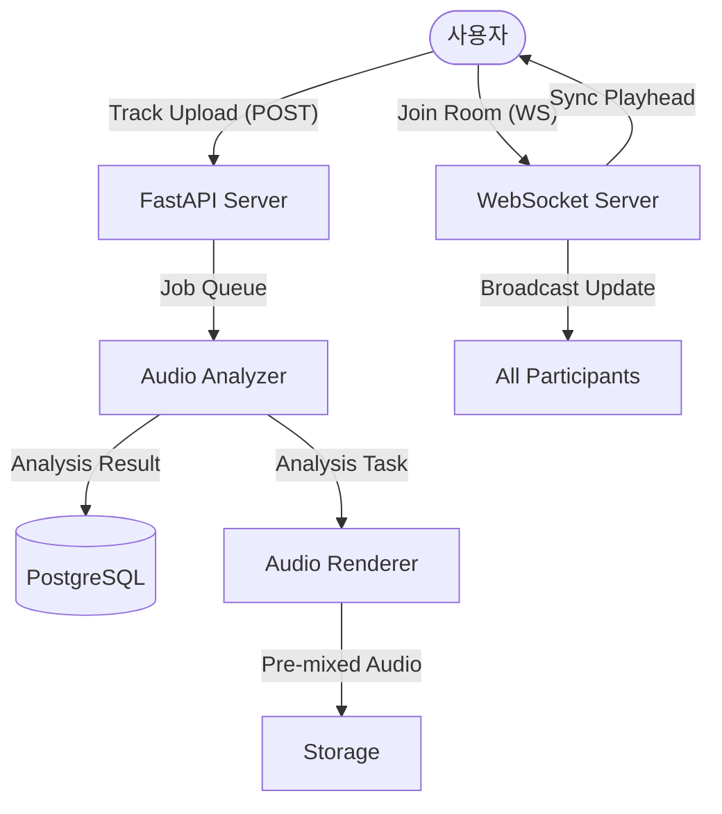

# Atomix: Next-Gen Music Mixer & Social Radio

**Atomix**는 인공지능 알고리즘을 통해 곡 사이의 자연스러운 전환(Cross-mixing)을 자동화하고, 이를 실시간으로 공유할 수 있는 **스마트 음악 플랫폼**입니다.

이 프로젝트는 **Madcamp 2025 Week 4** 프로젝트로 개발되었으며, 고성능 오디오 분석 엔진과 정밀한 실시간 동기화 기술을 기반으로 합니다.

---

## 핵심 가치 (Core Philosophy)

### Seamless Experience
곡 전환 시 발생하는 정적과 어색함을 제거합니다. 오디오 분석을 통해 최적의 타이밍에 크로스페이드를 적용하여 끊김 없는 감상 환경을 제공합니다.

### Shared Harmony
서버 주도의 마스터 클록 시스템을 통해 모든 참여자가 0.1초 미만의 오차로 동일한 지점의 음악을 함께 감상할 수 있는 라이브 동기화를 지원합니다.

### Aesthetic Design
사용자 경험을 극대화하기 위해 다크 모드 기반의 네온 테마와 부드러운 인터랙션을 적용하여 시각적 완성도를 높였습니다.

---

## 주요 기능 (Key Features)

### 1. 개인 지능형 믹스 (Personal Smart Mix)
단순 재생을 넘어 서버 사이드 렌더링을 통한 고품질 믹싱을 제공합니다.
- **Audio Analysis**: 업로드된 곡의 엔벨로프, BPM, 다운비트를 정밀 추출합니다.
- **Smart Sequencing**: 분위기와 템포를 고려하여 에너지 흐름이 가장 자연스러운 순서로 자동 재배치합니다.
- **Pre-rendered Mixing**: 샘플 단위의 정확도를 가진 볼륨 오토메이션과 크로스페이드를 적용합니다.

### 2. 소셜 라디오 (Social Radio & Live Sync)
실시간 협업형 음악 감상 시스템입니다.
- **Global Sync**: 서버가 관리하는 마스터 본(Master Playhead)을 기준으로 모든 클라이언트의 재생 위치를 강제 동기화합니다.
- **Dynamic Queue**: 재생 중에도 누구나 새로운 곡을 큐에 추가할 수 있으며, 시스템은 즉시 다음 믹싱 지점에 이를 결합합니다.
- **Live Interaction**: 실시간 접속자 상태와 현재 재생 중인 세그먼트 정보를 확인하며 상호작용합니다.

---

## 기술 아키텍처 (Technical Architecture)

Atomix는 고성능 오디오 처리와 대규모 실시간 연결을 위해 최적화된 비동기 분산형 아키텍처를 채택했습니다.

### 시스템 데이터 흐름 (System Flow)



### 기술 스택 (Tech Stack)

#### Frontend
- **Framework**: React 19, Vite
- **Styling**: Tailwind CSS 4.0, Radix UI (Primitives)
- **Animation**: Framer Motion
- **Communication**: Native WebSockets, REST API

#### Backend
- **Core**: Python, FastAPI
- **Database**: PostgreSQL, SQLAlchemy, Alembic
- **Audio Engine**: 
  - **Analysis**: Librosa, Essentia
  - **Rendering**: Pydub, FFmpeg
- **Infrastructure**: Docker Compose

---

## 프로젝트 구조 (Project Structure)

```text
Mix-Generator/
├── frontend/                     # Frontend Application (React)
│   ├── src/app/
│   │   ├── components/           # UI Components (MixPlayer, RadioRoom)
│   │   ├── api/                  # API Clients & Types
│   │   └── hooks/                # Audio Sync & State Logic
│   └── styles/                   # Design System & Themes
│
└── backend/                      # Backend System (Python)
    ├── atomix/
    │   ├── api/                  # REST & WebSocket Handlers
    │   ├── services/             # Core Business Logic
    │   ├── analyzers/            # Audio Analysis Logic
    │   ├── renderers/            # Audio Mixing Engine
    │   └── runtime/              # Server-side State Management
    ├── alembic/                  # Database Migrations
    └── docker-compose.yml        # Environment Setup
```

---

## API 사양 (API Specifications)

### REST API
| Method | Endpoint | Description |
| :--- | :--- | :--- |
| `POST` | `/v1/rooms` | 방 생성 및 초기 트랙 업로드 |
| `GET` | `/v1/rooms` | 전체 방 목록 및 상태 조회 |
| `POST` | `/v1/rooms/{id}/tracks` | 실시간 트랙 추가 및 믹싱 요청 |
| `GET` | `/v1/mixes/{id}` | 믹스 상세 정보 조회 |

### WebSocket Events
- `room_info`: 현재 재생 상태 및 참여자 정보 수신
- `revision_ready`: 새로운 믹스 버전 생성 알림
- `presence_update`: 실시간 참여자 변동 브로드캐스트

---

## 설치 및 시작하기 (Getting Started)

### 사전 요구 사항
- Node.js v20+ / Python 3.11+
- FFmpeg (시스템 필수 설치)
- PostgreSQL

### 실행 방법

1.  **Repository 준비**
    ```bash
    git clone https://github.com/eunji0456/Mix-Generator.git
    cd Mix-Generator
    ```

2.  **Backend 실행**
    ```bash
    cd backend
    pip install -r requirements.txt
    python main.py
    ```

3.  **Frontend 실행**
    ```bash
    cd frontend
    npm install
    npm run dev
    ```

---

## 팀 정보 (Team)
- **Frontend & Design**: [Eunji Park](https://github.com/eunji0456)
- **Backend & Audio Engine**: [Gmin Park](https://github.com/gminpark0117)

---

## 라이선스 (License)
이 프로젝트는 MIT License를 따릅니다.
